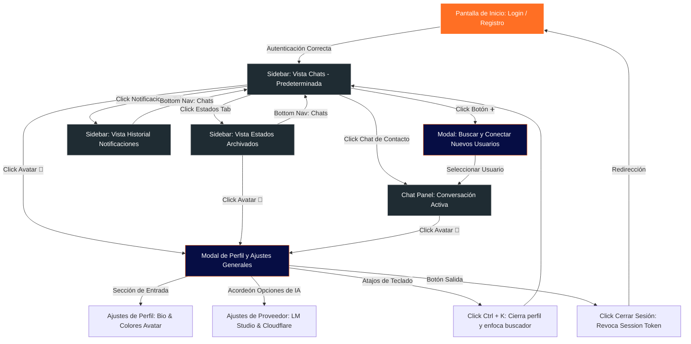

# Esquema de Pantallas y Opciones de Configuración - Tapchat

Este documento describe la arquitectura visual, la navegación móvil-first y la estructura completa de todas las opciones de configuración disponibles en la plataforma de Tapchat.

---

## 1. Esquema Estructural de la Interfaz (Layout)

A continuación se detalla la disposición general de los componentes en la pantalla una vez que el usuario ha iniciado sesión. El diseño es responsivo: en dispositivos móviles se superponen los paneles (mostrando o el Sidebar o el Chat), mientras que en pantallas de escritorio se visualizan uno al lado del otro.

```text
========================================================================================
                                     TAPCHAT SYSTEM
========================================================================================
[ 1. SIDEBAR (Izquierda / Principal) ]      | [ 2. CHAT PANEL (Derecha / Activo) ]
--------------------------------------------+-------------------------------------------
| HEADER:                                   | | HEADER:                                 |
| [ Título de Tab ] [🔄 Reload] [👤 Avatar]*| | [← Volver] [📁 Recursos] [🔄] [👤 Avatar]*|
--------------------------------------------| |-----------------------------------------|
| STATUS BAR:                               | |                                         |
|  ● Conectado/Reconectando · Unread count  | | AREA DE MENSAJES (Burbujas en Cascada):  |
--------------------------------------------| |  - [Bubble Mine] ✓✓                     |
| SEARCH / DISCOVERY:                       | |  - [Bubble Theirs] (Grammar check error)|
|  [ 🔍 Buscar chat o estado...  ]  [ ➕ ]  | |  - [Audio / Video / Image Previews]     |
--------------------------------------------| |  - [Suggested Reply parallel items]      |
| CONTENT FEED AREA (Dinámico por Tab):     | |                                         |
|  - TAB CHATS: Lista de chats recientes    | |-----------------------------------------|
|  - TAB ESTADOS: Lista de estados archiv.  | | COMPOSER FOOTER (Creador de mensajes):  |
|  - TAB NOTIF: Alertas, unread background  | |  - [ Panel de Respuestas Paralelas ]    |
--------------------------------------------| |  - [ Input de texto / borrador (Draft) ]|
| BOTTOM NAVIGATION BAR:                    | |  - [✨ Sugerencia] [📤 Enviar original]  |
|  [ ⭕ Estados ] [ 💬 Chats ] [ 🔔 Notif. ]| |                                         |
========================================================================================
*Nota: Al pulsar cualquier [👤 Avatar] (arriba a la derecha), se despliega el menú general.
```

---

## 2. Mapa de Flujo y Navegación (Mermaid)

El siguiente diagrama detalla cómo navega el usuario entre las distintas pantallas y cómo interactúan las alertas y configuraciones:



---

## 3. Descripción de Pantallas y Secciones

### A. Pantalla de Acceso (Login / Registro)
- **Propósito:** Puerta de entrada segura. Reemplaza el token global por un sistema multiusuario.
- **Detalles Visuales:** Tarjeta con efectos de desenfoque de fondo (glassmorphism), pestañas interactivas para cambiar suavemente entre **Iniciar Sesión** y **Crear Cuenta**.
- **Campos:** Usuario, Correo Electrónico, Contraseña y Confirmar Contraseña (con validaciones en tiempo real).

### B. Sidebar Principal (Panel de Control Izquierdo)
1. **Header (Cabecera):**
   - Muestra el nombre de la sección activa según el Tab inferior (**Chats**, **Estados**, **Notificaciones**).
   - **Botón Actualizar (🔄):** Fuerza la sincronización de contactos y estados locales con el servidor backend.
   - **Foto de Usuario (👤):** Avatar circular interactivo coloreado dinámicamente con tu gradiente seleccionado. Al pulsarlo, abre el panel de configuración general.
2. **Status Bar (Barra de Estado):**
   - Muestra un punto de estado de socket en vivo (Verde = Conectado, Amarillo = Reconectando, Rojo = Desconectado).
   - Muestra el total de mensajes pendientes no leídos en toda la aplicación.
3. **Buscador y Descubridor:**
   - **Campo de Texto:** Caja con fondo `#060d44` y borde enfocado en naranja. Permite filtrar al instante por nombre o ID de chat.
   - **Botón ➕:** Abre la ventana flotante de búsqueda global en la red para iniciar nuevos chats con otros usuarios usando su nombre o correo.
4. **Listas de Contenidos (Feed Central):**
   - **Chats:** Muestra una cascada de contactos activos, chats grupales y el **Asistente de IA (AI Companion)**, reflejando el último mensaje, tiempo transcurrido y burbujas con números de mensajes no leídos.
   - **Estados:** Renderiza miniaturas con el avatar y nombre del usuario que subió el estado, junto a la descripción y fecha de subida.
   - **Notificaciones:** Lista en tiempo real de notificaciones locales y del sistema (mensajes recibidos en segundo plano mientras chateabas con otro contacto). Permite la eliminación uno a uno haciendo clic en `❌`.
5. **Bottom Navigation Bar (Navegación Inferior):**
   - Tres botones de igual tamaño distribuidos uniformemente para navegar de inmediato en dispositivos móviles. Al activarse, aplican un brillo naranja (`#ff6f24`) y sombras de texto.

### C. Chat Panel (Panel de Conversación Activo)
- **Cabecera del Chat:** Muestra el avatar de tu contacto (con sus iniciales y gradiente propio), su nombre/ID, y un botón para abrir el modal de **Recursos**. En la esquina derecha cuenta con su propio acceso al menú de configuración general (foto de perfil del usuario logueado).
- **Área de Mensajes:** Lista en cascada con soporte de:
  - Mensajes propios con checkmarks inteligentes de estado (✓ = Enviado, ✓✓ gris = Recibido, ✓✓ azul = Leído).
  - Previsualizaciones de archivos multimedia directos (Imágenes, Videos y Audios).
  - Alertas de sugerencias ortográficas/gramaticales por IA en mensajes entrantes.
- **Borrador y Composer:** Cuadro inteligente de texto para redactar con un botón dinámico para consultar sugerencias de IA (`✨ Ver sugerencia`) y dos canales de envío (`📤 Enviar original` o enviar sugerencia).

---

## 4. Opciones de Configuración Completa (Modal de Perfil)

El menú flotante **👤 Mi Perfil y Ajustes** unifica toda la personalización de tu cuenta en una única ventana:

### I. Ajustes de Cuenta y Perfil (Guardar Perfil)
| Propiedad | Tipo de Entrada | Descripción |
| :--- | :--- | :--- |
| **Usuario / Username** | Texto (Solo Lectura) | Nombre único de tu cuenta. |
| **Correo / Email** | Texto (Solo Lectura) | Correo electrónico enlazado a tu sesión. |
| **Estado / Biografía** | Campo editable (`userBioInput`) | Tu frase de perfil que verán otros usuarios al buscarte. |
| **Color de Avatar** | Campo editable (`userAvatarColorInput`) | Código Hexadecimal, HSL, RGB o gradiente lineal. |
| **Preset Dots** | Botones de Color Rápido | 8 círculos con colores de moda (Naranja, Azul, Verde, Violeta, etc.) que cambian tu color de avatar en un solo clic y aplican una previsualización en vivo. |

### II. Opciones Avanzadas del Asistente de IA (Guardar IA)
Encapsuladas en un bloque expandible `<details>` para no congestionar la interfaz principal:
- **Proveedor:** Selector de origen (`lmstudio` para modelos locales u offline, o `cloudflare` para nube distribuida).
- **Endpoint Activo:** Campo de información autogenerado con la dirección URL a la cual se dirigirán las consultas del chat *AI Companion*.
- **Configuración de Conexión:**
  - *LM Studio:* Caja de texto para cambiar la URL base de tu servidor local (Ej: `http://localhost:1234`).
  - *Cloudflare AI:* Casillas para tu **ID de Cuenta** y tu **API Token** seguro (con botón de ojo `👁️` para ocultar o revelar las credenciales), además de una URL base personalizada opcional.
- **Modelo:** Selector dinámico con los modelos detectados por el endpoint, o entrada de texto manual si deseas forzar un modelo específico (Ej: `llama-3-8b-instruct`).
- **Parámetros del Modelo:**
  - *Temperatura:* Regulador numérico del grado de creatividad del asistente (de `0.0` a `2.0`).
  - *Timeout:* Tiempo máximo de espera antes de abortar la respuesta de la IA (en milisegundos).
  - *Max Tokens:* Número máximo de caracteres/palabras de salida en la respuesta generada.
- **Prompts de Comportamiento:**
  - *Prompt de Sistema:* Instrucciones fijas que definen el rol del asistente de IA.
  - *Prompt de Usuario:* Plantilla personalizada para el procesamiento de sugerencias gramaticales (admite el comodín `{` `{text}` `}`).
- **Botones del Módulo:**
  - `🧪 Probar Conexión`: Envía una señal rápida para verificar la comunicación con LM Studio o Cloudflare, devolviendo un cartel verde de éxito o rojo con el error de red exacto.
  - `💾 Guardar IA`: Almacena la configuración de prompts, endpoints y modelos en el servidor del usuario.

### III. Panel de Atajos de Teclado
- **Buscar chats o usuarios (`Ctrl + K`):** Cuenta con un botón que enfoca directamente la barra de búsqueda para que empieces a escribir de inmediato.
- **Navegar entre chats (`Alt + ↑ / ↓`):** Indica visualmente cómo saltar rápidamente de una conversación a otra sin tener que usar el ratón o pantalla táctil.

### IV. Cierre de Sesión Seguro
- **Cerrar Sesión Activa:** Botón con diseño de peligro translúcido que elimina instantáneamente el token de acceso de `localStorage`, desconecta de forma limpia la conexión Socket.io con el servidor y limpia la caché local de IndexedDB del navegador.
